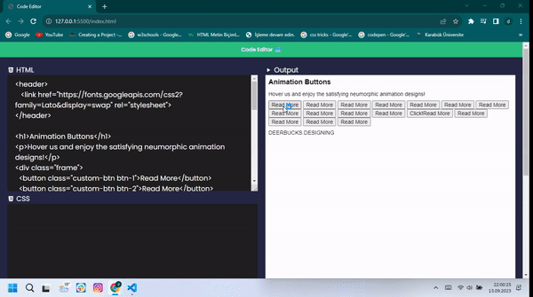

# code-Editor

Code Editor Projesi
Bu proje, kullanıcıların farklı programlama dillerinde kod yazmalarını ve düzenlemelerini sağlayan bir kod düzenleyici uygulamasını içerir. Bu uygulama, kullanıcılara kodlama deneyimlerini geliştirmek ve kodlarını daha etkili bir şekilde yazmak için bir dizi özellik sunar.

Özellikler
Farklı programlama dillerini destekleme.
Kod vurgulama (syntax highlighting) özelliği.
Otomatik kod düzeltme (auto-indentation) özelliği.
Geçmiş kod değişikliklerini kaydetme ve geri alma.
Uzantılar (extensions) ekleyebilme ve kullanabilme.
Başlarken
Bu projeyi yerel ortamınızda çalıştırmak ve geliştirmek için aşağıdaki adımları izleyebilirsiniz.

Bu deposu yerel makinenize kopyalayın:

bash
Copy code
git clone https://github.com/DurmusFSD/code-Editor.git
Proje klasörüne gidin:

bash
Copy code
cd code-editor
Gerekli bağımlılıkları yükleyin:

bash
Copy code
npm install
Uygulamayı başlatın:

bash
Copy code
npm start
Tarayıcınızı açın ve http://localhost:3000 adresine gidin.

Kullanım
Uygulama başladığında, kullanıcıların kod yazmaya başlayabileceği bir kod düzenleme alanı sunar. Kullanıcılar farklı programlama dilleri seçebilirler ve yazdıkları kodlar otomatik olarak vurgulanır. Ayrıca, kodu kaydedebilir, geri alabilir ve geçmiş değişiklikleri gözden geçirebilirler.

Katkıda Bulunma
Eğer bu projeye katkıda bulunmak isterseniz, lütfen aşağıdaki adımları izleyin:

Bu projeyi forklayın.
Yeni bir özellik veya hata düzeltmesi ekleyin.
Değişikliklerinizi yapın ve düzenli bir şekilde commit'leyin.
Bir pull isteği (pull request) açın ve değişikliklerinizi tartışmaya açın.
Lisans
Bu proje MIT lisansı altında lisanslanmıştır. Daha fazla bilgi için LICENSE dosyasına bakın.

İletişim
Eğer herhangi bir sorunuz veya geri bildiriminiz varsa, lütfen durmusozgul66@gmail.com adresi üzerinden bizimle iletişime geçin.

Teşekkürler
Bu projeyi kullanmayı tercih ettiğiniz için teşekkür ederiz!

Durmuş Özgül
